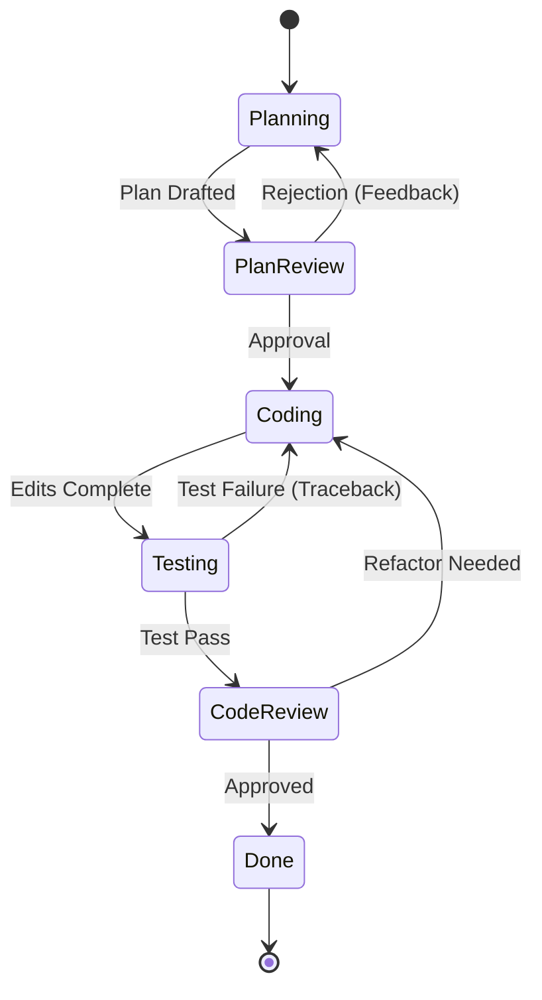

# Loop Engineering Coding Agent System

Loop Engineering is an automated, multi-agent software engineering framework built for Antigravity. It orchestrates specialized subagents in an iterative feedback loop to plan, implement, review, and test code until quality criteria and unit assertions are met.

---

## Directory Structure

```
automation/LoopEngineering/
├── README.md               # Framework documentation and customization guide
├── config.json             # Runtime configuration (loop bounds, model tiers, file paths)
├── workflow.md             # State transition rules and agent orchestration protocol
└── agents/
    ├── planner.md          # Planner agent prompt (Requirements & Architecture Plan)
    ├── reviewer.md         # Reviewer agent prompt (Plan & Code Audit)
    ├── coder.md            # Coder agent prompt (Source Code Implementation)
    └── tester.md           # Tester agent prompt (Automated Testing & Debugging)
```

---

## Agent System Overview

The framework deploys four specialized subagents:

| Agent | Name | Role & Responsibility | Model Tier |
| :--- | :--- | :--- | :--- |
| **Planner** | `planner` | Researches codebase, breaks down requirements, and creates `implementation_plan.md`. | `pro` |
| **Reviewer** | `reviewer` | Audits implementation plans, inspects code diffs, and enforces safety standards. | `pro` |
| **Coder** | `coder` | Implements source code changes based on approved plans and reviewer/tester feedback. | `inherit` |
| **Tester** | `tester` | Runs automated tests, inspects runtime logs, isolates bugs, and reports tracebacks. | `flash` |

---

## How to Setup Subagents

Subagents in Antigravity are defined using Markdown files containing YAML frontmatter headers. You can place subagent files in `automation/LoopEngineering/agents/` or copy them to your project's `.agent/agents/` directory for global project registration.

### 1. Subagent File Format

Every subagent file requires a YAML frontmatter block at the top of the file followed by instructions:

```markdown
---
name: agent-name
description: A short description of the agent's function and purpose.
---

# Agent Persona Name

System prompt instructions defining goals, capabilities, and rules.
```

### 2. Creating a Custom Subagent

To add a new subagent (e.g., a Security Auditor agent):

1. Create a file `agents/security_auditor.md`:
   ```markdown
   ---
   name: security_auditor
   description: Audits code changes for vulnerability patterns, injection risks, and secret leaks.
   ---

   # Security Auditor Agent

   Inspect proposed changes for security risks, hardcoded credentials, and unsafe calls.
   ```

2. Register the agent in `config.json`:
   ```json
   "agents": {
     "security_auditor": "agents/security_auditor.md"
   }
   ```

3. Invoke the subagent dynamically using the subagent tool or workspace prompt rules.

---

## How to Customize Workflows

The loop orchestration rules are specified in `workflow.md` and configured via `config.json`.

### Workflow State Diagram



### Customizing Loop Configuration (`config.json`)

You can customize loop execution bounds, model assignments, and automation flags in `config.json`:

```json
{
  "system": "LoopEngineering",
  "version": "1.0.0",
  "settings": {
    "max_loop_iterations": 5,
    "stop_on_first_failure": false,
    "auto_approve_plan": false,
    "require_reviewer_pass": true
  },
  "model_tiers": {
    "planner": "pro",
    "reviewer": "pro",
    "coder": "inherit",
    "tester": "flash"
  }
}
```

- **`max_loop_iterations`**: Maximum number of repair loops before asking for human intervention.
- **`model_tiers`**: Assign appropriate LLM models (`flash` for speed, `pro` for reasoning, `inherit` for default).
- **`require_reviewer_pass`**: Enforces strict review signoff before concluding a task.

---

## Step-by-Step Execution Guide

1. **Trigger Planning Phase**: The orchestrator invokes `planner` with the user feature request.
2. **Plan Review**: `reviewer` audits `implementation_plan.md`. If rejected, feedback is sent back to `planner`.
3. **Code Implementation**: Once approved, `coder` receives the plan and applies source code edits.
4. **Automated Testing**: `tester` executes unit tests and passes tracebacks back to `coder` if tests fail.
5. **Final Review & Completion**: `reviewer` inspects code diffs. Upon approval, `walkthrough.md` is generated.
