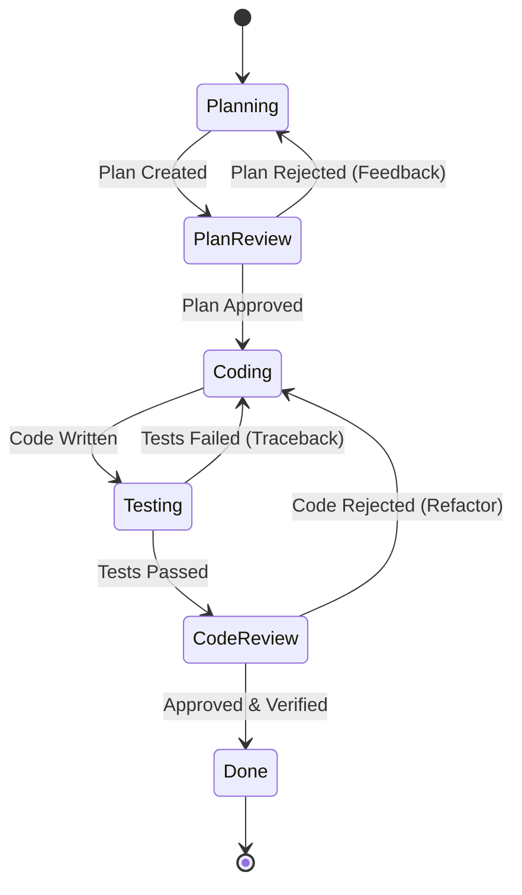

# Loop Engineering Workflow Specification

This document defines the state transition rules and interaction protocol for the Loop Engineering Agent System.

## State Machine Overview

## Workflow Stages & State Machine Rules

### Stage 1: Planning (`Planning`)
- **Agent**: `Planner`
- **Trigger**: User request or high-level specification.
- **Action**: Analyze requirements, search codebase, write `implementation_plan.md`.
- **Next State**: `PlanReview`

### Stage 2: Plan Review (`PlanReview`)
- **Agent**: `Reviewer`
- **Trigger**: `implementation_plan.md` created or updated.
- **Action**: Audit proposed architecture, security impact, and file list.
- **Transitions**:
  - If approved $\rightarrow$ `Coding`
  - If rejected $\rightarrow$ `Planning` (with revision feedback)

### Stage 3: Coding (`Coding`)
- **Agent**: `Coder`
- **Trigger**: Plan approved or test/review feedback received.
- **Action**: Modify target source files according to plan specifications or feedback requirements.
- **Next State**: `Testing`

### Stage 4: Testing & Debugging (`Testing`)
- **Agent**: `Tester`
- **Trigger**: Source code edits completed by `Coder`.
- **Action**: Run build scripts, unit test suites, or runtime verification.
- **Transitions**:
  - If tests pass $\rightarrow$ `CodeReview`
  - If tests fail $\rightarrow$ `Coding` (with exact failure traceback)

### Stage 5: Code Review (`CodeReview`)
- **Agent**: `Reviewer`
- **Trigger**: `Testing` returns `VERDICT: PASS`.
- **Action**: Review code diffs for quality, style adherence, and maintainability.
- **Transitions**:
  - If approved $\rightarrow$ `Done`
  - If refactoring needed $\rightarrow$ `Coding` (with review notes)

### Stage 6: Completion (`Done`)
- **Action**: Create `walkthrough.md`, present summary of verified changes to the user.

## Termination Conditions
The loop terminates successfully when:
1. `Reviewer` approves both plan and code diff.
2. `Tester` confirms 100% test suite pass rate.
3. Total loop count is less than `max_loop_iterations` (default: 5).
