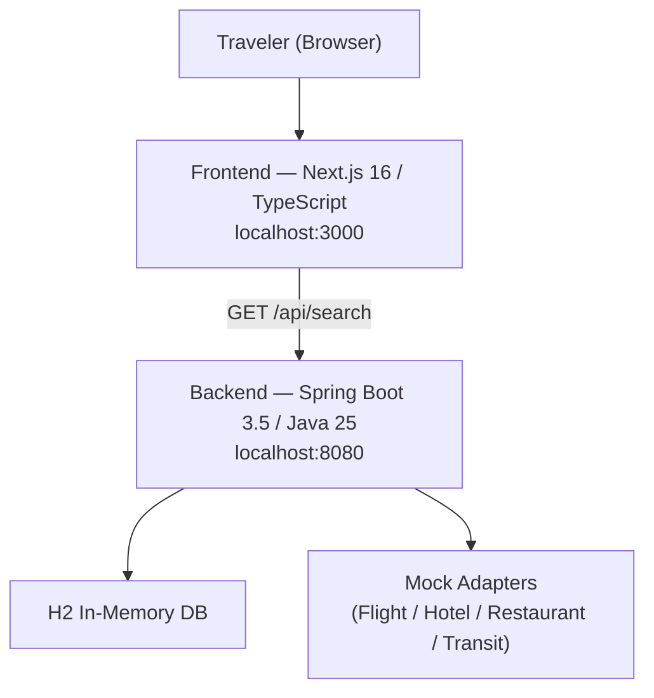
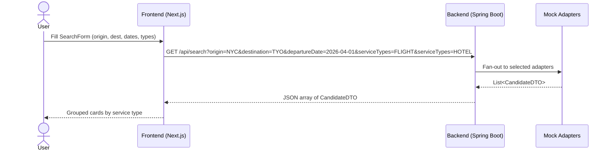
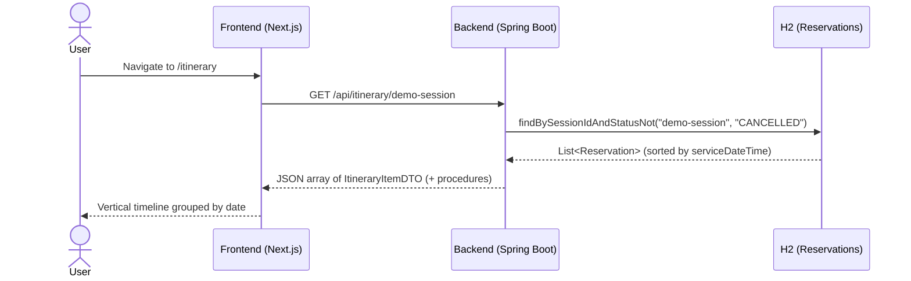

# Walkthrough: myAdventure

## Phase 0 + Phase 1

### Overview

This document walks through the implementation of **Phase 0 (Scaffolding)** and **Phase 1 (Search)** of myAdventure — an OTA-style travel itinerary and reservation management web application.

References: `specs/plan.md`, `specs/requirements.md`, `specs/user_story.md`

---

### Architecture Recap



---

## Phase 0 — Project Scaffolding

### Goals
- Runnable backend and frontend skeletons
- CORS wired up so the frontend can call the backend
- Health check endpoint to verify connectivity

### Backend (Spring Boot 3.5 + Gradle + Java 25)

**Generated via Spring Initializr** with dependencies:
- `spring-boot-starter-web` — REST controllers
- `spring-boot-starter-data-jpa` — ORM (for Phases 2+)
- `h2` — in-memory database
- `lombok` — boilerplate reduction

**Key files created:**

| File | Purpose |
|------|---------|
| `build.gradle` | Gradle build with Java 25 toolchain |
| `src/main/resources/application.properties` | H2 datasource + JPA config |
| `config/CorsConfig.java` | Allows `http://localhost:3000` on `/api/**` |
| `controller/HealthController.java` | `GET /api/health` → `"OK"` |

**`application.properties` highlights:**
```properties
spring.datasource.url=jdbc:h2:mem:myadventure;DB_CLOSE_DELAY=-1
spring.jpa.hibernate.ddl-auto=create-drop
spring.h2.console.enabled=true
```

**CORS config pattern (Spring `WebMvcConfigurer`):**
```java
registry.addMapping("/api/**")
        .allowedOrigins("http://localhost:3000")
        .allowedMethods("GET","POST","PUT","PATCH","DELETE","OPTIONS")
        .allowedHeaders("*");
```

### Frontend (Next.js 16 App Router + TypeScript + Tailwind)

**Generated via `create-next-app`** with:
- TypeScript, Tailwind CSS, ESLint, App Router
- `zustand` added for cart/state management

**Key files created:**

| File | Purpose |
|------|---------|
| `app/layout.tsx` | Root layout with `<NavBar />` and `bg-gray-50` body |
| `components/NavBar.tsx` | Sticky nav with live cart badge |
| `app/cart/page.tsx` | Cart page stub (functional in Phase 2) |
| `app/itinerary/page.tsx` | Itinerary placeholder (Phase 3) |

### Exit Criteria ✅
- `./gradlew bootRun` starts on port 8080
- `npm run dev` starts on port 3000
- `GET http://localhost:8080/api/health` returns `200 OK`

---

## Phase 1 — Search Feature (F-01 – F-04)

### Goals
User can input dates and destinations, select service types, and see candidates for all 4 service types (flights, hotels, restaurants, transit).

### Data Flow



### Backend Implementation

#### Layer diagram

```
SearchController  →  SearchService  →  [FlightAdapter, HotelAdapter, RestaurantAdapter, TransitAdapter]
```

#### `SearchRequestDTO` (record)
```java
public record SearchRequestDTO(
    String origin,
    String destination,
    LocalDate departureDate,
    LocalDate returnDate,        // optional
    List<ServiceType> serviceTypes // null = all types
) {}
```

#### `CandidateDTO` (record)
```java
public record CandidateDTO(
    String id,            // UUID
    ServiceType serviceType,
    String summary,
    String origin,
    String destination,
    LocalDateTime serviceDateTime,
    BigDecimal price,
    String currency,
    String details
) {}
```

#### `SearchService` fan-out logic
```java
public List<CandidateDTO> search(SearchRequestDTO req) {
    List<ServiceType> types = req.serviceTypes() != null
        ? req.serviceTypes() : List.of(ServiceType.values());

    List<CandidateDTO> results = new ArrayList<>();
    if (types.contains(FLIGHT))     results.addAll(flightAdapter.search(req));
    if (types.contains(HOTEL))      results.addAll(hotelAdapter.search(req));
    if (types.contains(RESTAURANT)) results.addAll(restaurantAdapter.search(req));
    if (types.contains(TRANSIT))    results.addAll(transitAdapter.search(req));
    return results;
}
```

#### Mock Adapters
Each adapter returns 2 hardcoded `CandidateDTO` records using the request's origin/destination/date to generate realistic summaries. UUIDs are generated fresh per call so IDs are always unique.

#### `GET /api/search` endpoint
```
GET /api/search?origin=NYC&destination=TYO&departureDate=2026-04-01&serviceTypes=FLIGHT&serviceTypes=HOTEL
```
Query params:
| Param | Type | Required |
|-------|------|----------|
| `origin` | String | ✅ |
| `destination` | String | ✅ |
| `departureDate` | `yyyy-MM-dd` | ✅ |
| `returnDate` | `yyyy-MM-dd` | ❌ |
| `serviceTypes` | `FLIGHT\|HOTEL\|RESTAURANT\|TRANSIT` (multi) | ❌ (default: all) |

#### Unit Tests (`SearchServiceTest`)
Two tests using Mockito (no Spring context needed — pure unit test):
1. `returnsAllServiceTypes_whenNoFilterSpecified` — asserts 4 results with null serviceTypes
2. `returnsOnlyFlights_whenFilteredByFlight` — asserts 1 FLIGHT result; verifies other adapters not called

**Build & test result:**
```
BUILD SUCCESSFUL
> Task :test — 2 tests passed
```

### Frontend Implementation

#### Component tree
```
app/page.tsx (Client Component)
├── SearchForm.tsx       — controlled form, service type toggle pills
└── [results] grouped by serviceType
    └── CandidateCard.tsx  — price card with Add/Remove cart button
```

#### `lib/types.ts`
Shared TypeScript interfaces: `ServiceType`, `CandidateDTO`, `SearchParams`.

#### `lib/api.ts` — `searchCandidates()`
Builds a `URLSearchParams` query string, fetches `GET /api/search`, returns `CandidateDTO[]`. `NEXT_PUBLIC_API_URL` env var defaults to `http://localhost:8080`.

#### `lib/store.ts` — Zustand cart store
```typescript
const useCartStore = create<CartStore>((set) => ({
  items: [],
  addItem:    (item) => set(s => ({ items: [...s.items.filter(i => i.id !== item.id), item] })),
  removeItem: (id)   => set(s => ({ items: s.items.filter(i => i.id !== id) })),
  clear:      ()     => set({ items: [] }),
}));
```
Cart state is **in-memory** (persists across page navigations within the same browser session via Zustand's reactive store).

#### `SearchForm.tsx`
- Controlled inputs: origin, destination, departure date, return date
- Service type toggle pills (blue = selected, grey = unselected) — all selected by default
- Calls `onSearch` prop on submit

#### `CandidateCard.tsx`
- Displays: service type badge (color-coded), summary, details, date/time, price
- "Add to Cart" / "Remove from Cart" toggle driven by Zustand `useCartStore`

#### `NavBar.tsx`
- Sticky top navigation
- Cart badge shows live count from Zustand store (no prop drilling)

#### `app/page.tsx`
- Owns search state (`results`, `loading`, `error`, `searched`)
- Groups results by `serviceType` using `reduce`
- Shows empty state and error states

### Exit Criteria ✅
- Entering valid origin, destination, and departure date shows ≥ 2 candidates per selected service type
- Cards display price, summary, details, and date/time
- "Add to Cart" button adds item to Zustand store; cart badge in NavBar updates immediately

**Frontend build result:**
```
▲ Next.js 16 (Turbopack)
✓ Compiled successfully
Route (app)
  ○ /
  ○ /cart
  ○ /itinerary
```

---

## How to Run Locally

### Backend
```bash
cd backend
JAVA_HOME=~/.jdks/openjdk-25.0.2 ./gradlew bootRun
# → http://localhost:8080/api/health
```

### Frontend
```bash
cd frontend
npm run dev
# → http://localhost:3000
```

### Test the Search API directly
```bash
curl "http://localhost:8080/api/search?origin=NYC&destination=TYO&departureDate=2026-04-01"
```

---

## Directory Structure After Phase 1

```
myAdventure/
├── backend/
│   ├── build.gradle                        # Java 25 toolchain, Spring Boot 3.5
│   ├── src/main/
│   │   ├── java/com/myadventure/
│   │   │   ├── BackendApplication.java
│   │   │   ├── config/CorsConfig.java
│   │   │   ├── controller/
│   │   │   │   ├── HealthController.java   # GET /api/health
│   │   │   │   └── SearchController.java   # GET /api/search
│   │   │   ├── dto/
│   │   │   │   ├── CandidateDTO.java
│   │   │   │   └── SearchRequestDTO.java
│   │   │   ├── external/
│   │   │   │   ├── FlightAdapter.java
│   │   │   │   ├── HotelAdapter.java
│   │   │   │   ├── RestaurantAdapter.java
│   │   │   │   └── TransitAdapter.java
│   │   │   ├── model/enums/ServiceType.java
│   │   │   └── service/SearchService.java
│   │   └── resources/application.properties
│   └── src/test/java/com/myadventure/
│       └── service/SearchServiceTest.java  # 2 unit tests ✅
│
├── frontend/
│   ├── app/
│   │   ├── layout.tsx                      # NavBar injected
│   │   ├── page.tsx                        # Search + results
│   │   ├── cart/page.tsx                   # Cart view
│   │   └── itinerary/page.tsx              # Placeholder (Phase 3)
│   ├── components/
│   │   ├── CandidateCard.tsx
│   │   ├── NavBar.tsx
│   │   └── SearchForm.tsx
│   └── lib/
│       ├── api.ts
│       ├── store.ts
│       └── types.ts
│
└── specs/
    ├── user_story.md
    ├── requirements.md
    └── plan.md                             # Phase 0 + 1 checkboxes ticked ✅
```

---

## Phase 2 — Itinerary View (F-09 – F-11)

### Goals
User can view confirmed reservations as a chronological schedule, with per-service-type procedure checklists (pre-trip and in-trip).

### Data Flow



---

### Backend Implementation

#### New files

| File | Purpose |
|------|---------|
| `model/Reservation.java` | JPA entity — mirrors `RESERVATION` table from data model |
| `repository/ReservationRepository.java` | `findBySessionIdAndStatusNot` derived query |
| `dto/ItineraryItemDTO.java` | Response record — adds `procedures` list to reservation fields |
| `service/ItineraryService.java` | Fetch → filter CANCELLED → sort chronologically → attach procedures |
| `controller/ItineraryController.java` | `GET /api/itinerary/{sessionId}` |
| `config/DataInitializer.java` | Seeds 4 demo reservations for `"demo-session"` on startup |

#### `Reservation` entity (Lombok + JPA)
```java
@Entity
@Table(name = "reservations")
@Getter @Setter @NoArgsConstructor @AllArgsConstructor @Builder
public class Reservation {
    @Id private String id;
    private String sessionId;
    @Enumerated(EnumType.STRING) private ServiceType serviceType;
    private String externalId, summary, currency, origin, destination, details, status;
    @Column(precision = 10, scale = 2) private BigDecimal price;
    private LocalDateTime serviceDateTime, bookedAt;
}
```

#### `ItineraryService` — procedure attachment
```java
private static final Map<ServiceType, List<String>> PROCEDURES = Map.of(
    FLIGHT,     List.of("Check in online 24 h before departure", "Arrive at airport 2 h early", "Gate closes 30 min before departure"),
    HOTEL,      List.of("Confirm reservation 24 h before arrival", "Standard check-in: 3:00 PM", "Standard check-out: 11:00 AM"),
    RESTAURANT, List.of("Confirm reservation the day before", "Arrive 5 min before booking time", "Cancellation: notify at least 2 h ahead"),
    TRANSIT,    List.of("Validate ticket before boarding", "Check platform / line number", "Allow extra time during peak hours")
);

public List<ItineraryItemDTO> getItinerary(String sessionId) {
    return reservationRepository
        .findBySessionIdAndStatusNot(sessionId, "CANCELLED")
        .stream()
        .sorted(Comparator.comparing(Reservation::getServiceDateTime))
        .map(this::toDTO)
        .collect(Collectors.toList());
}
```

#### `GET /api/itinerary/{sessionId}` endpoint
```
GET /api/itinerary/demo-session
→ 200 OK  [ { id, serviceType, summary, serviceDateTime, price, procedures: [...] }, … ]
```

#### `DataInitializer` — demo seed data
Seeds 4 `CONFIRMED` reservations for `"demo-session"` on application startup:

| Service | Summary | Date |
|---------|---------|------|
| FLIGHT | NYC → TYO (Economy) | Apr 1, 09:00 |
| TRANSIT | Narita Airport → City Centre | Apr 1, 21:30 |
| HOTEL | Grand Hotel Tokyo | Apr 1, 15:00 |
| RESTAURANT | Sushi Saito Tokyo | Apr 2, 19:00 |

#### Unit Tests (`ItineraryServiceTest`) — 4 tests, all pass
```
> Task :test — 4 tests passed (SearchServiceTest × 2 + ItineraryServiceTest × 4 = 6 total)
BUILD SUCCESSFUL
```

Tests cover:
1. `returnsSortedChronologically` — later hotel after earlier flight
2. `attachesProceduresPerServiceType` — FLIGHT gets the flight checklist
3. `excludesCancelledReservations` — repository called with `statusNot="CANCELLED"`
4. `returnsEmptyList_whenNoReservations` — unknown session returns `[]`

---

### Frontend Implementation

#### New / updated files

| File | Change |
|------|--------|
| `lib/types.ts` | Added `ItineraryItem` interface (+ `procedures: string[]`) |
| `lib/api.ts` | Added `getItinerary(sessionId)` fetch function |
| `components/ItineraryTimeline.tsx` | New — vertical timeline component |
| `app/itinerary/page.tsx` | Replaced placeholder with live data fetch + timeline render |
| `jest.config.js` | New — Jest + next/jest config |
| `jest.setup.ts` | New — imports `@testing-library/jest-dom` |
| `__tests__/ItineraryTimeline.test.tsx` | New — 5 component tests |

#### `ItineraryItem` type
```typescript
export interface ItineraryItem {
  id: string;
  serviceType: ServiceType;
  summary: string;
  origin: string;
  destination: string;
  serviceDateTime: string;  // ISO string
  price: number;
  currency: string;
  details: string;
  status: string;
  bookedAt: string;
  procedures: string[];
}
```

#### `ItineraryTimeline.tsx` — component structure
```
ItineraryTimeline
├── Groups items by date (YYYY-MM-DD key)
├── Sorted date headers (h2 — e.g. "Wednesday, April 1, 2026")
└── Per item:
    ├── Color-coded timeline dot (service type color)
    ├── Service type badge + time
    ├── Summary + details + price
    └── Procedure checklist (☐ items)
```

#### Component Tests (`ItineraryTimeline.test.tsx`) — 5 tests, all pass
```
PASS __tests__/ItineraryTimeline.test.tsx
  ✓ renders a timeline item with summary and details
  ✓ renders procedure checklist items
  ✓ groups items under separate date headers
  ✓ renders nothing when items array is empty
  ✓ displays price and currency

Tests: 5 passed, 5 total
```

---

### Exit Criteria ✅
- `GET /api/itinerary/demo-session` returns 4 items sorted chronologically
- Items grouped into two date sections (Apr 1 and Apr 2)
- Each item shows: service type badge, time, summary, details, price, procedure checklist

---

## Directory Structure After Phase 2

```
myAdventure/
├── backend/
│   └── src/main/java/com/myadventure/
│       ├── config/
│       │   ├── CorsConfig.java
│       │   └── DataInitializer.java        # ← new: seeds demo-session reservations
│       ├── controller/
│       │   ├── HealthController.java
│       │   ├── SearchController.java
│       │   └── ItineraryController.java    # ← new: GET /api/itinerary/{sessionId}
│       ├── dto/
│       │   ├── CandidateDTO.java
│       │   ├── SearchRequestDTO.java
│       │   └── ItineraryItemDTO.java       # ← new: includes procedures[]
│       ├── model/
│       │   ├── enums/ServiceType.java
│       │   └── Reservation.java            # ← new: JPA entity
│       ├── repository/
│       │   └── ReservationRepository.java  # ← new: findBySessionIdAndStatusNot
│       ├── service/
│       │   ├── SearchService.java
│       │   └── ItineraryService.java       # ← new: sort + attach procedures
│       └── BackendApplication.java
│   └── src/test/java/com/myadventure/service/
│       ├── SearchServiceTest.java          # 2 tests ✅
│       └── ItineraryServiceTest.java       # ← new: 4 tests ✅
│
├── frontend/
│   ├── __tests__/
│   │   └── ItineraryTimeline.test.tsx      # ← new: 5 tests ✅
│   ├── app/
│   │   ├── layout.tsx
│   │   ├── page.tsx
│   │   ├── cart/page.tsx
│   │   └── itinerary/page.tsx              # ← replaced placeholder with live UI
│   ├── components/
│   │   ├── CandidateCard.tsx
│   │   ├── ItineraryTimeline.tsx           # ← new: vertical timeline
│   │   ├── NavBar.tsx
│   │   └── SearchForm.tsx
│   ├── lib/
│   │   ├── api.ts                          # ← added getItinerary()
│   │   ├── store.ts
│   │   └── types.ts                        # ← added ItineraryItem interface
│   ├── jest.config.js                      # ← new
│   └── jest.setup.ts                       # ← new
│
└── specs/
    ├── user_story.md
    ├── requirements.md
    └── plan.md                             # Phase 0–2 checkboxes ticked ✅
```

---

## What's Next (Phase 3 — Schedule Adjustment)

- Backend: `PATCH /api/bookings/{id}`, `DELETE /api/bookings/{id}`, `GET /api/search/alternatives`
- Frontend: Edit/Cancel buttons on itinerary, edit modal, alternatives panel
- Tests: `BookingModificationServiceTest`
