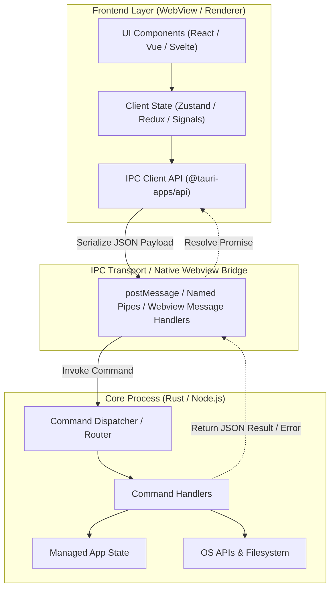
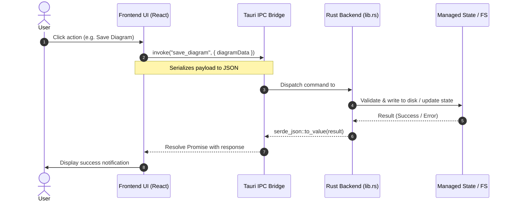
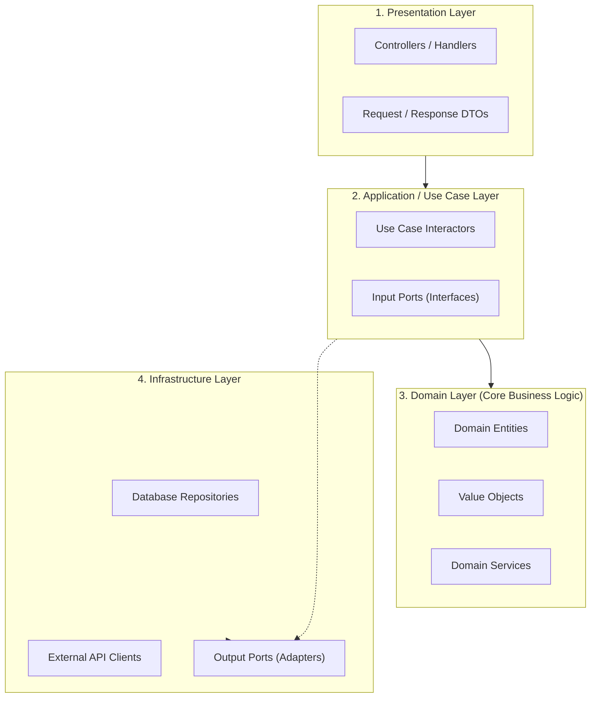

# Mermaid Architecture & Flow Templates

Use these production-grade templates when synthesizing Mermaid diagrams.

---

## 1. Multi-Process Architecture (e.g. Tauri / Electron)

---

## 2. IPC Request-Response Sequence

---

## 3. Clean / Layered Architecture

