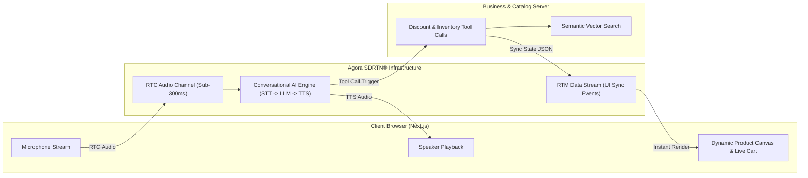

# 💡 Example: Conversational AI Ideation Walkthrough

This reference demonstrates an end-to-end execution of the `problem-solving` skill for the **Agora Conversational AI Hackathon (EchoSphere)**.

---

## Phase 1: Issue & "Why" Decomposition

### Problem Statement: Voice E-Commerce & Customer Sales
- **Target User**: Online buyers navigating complex, high-consideration purchases (e.g. electronics, customized gear, enterprise software).
- **Core Friction**: High cart abandonment (70%+) and slow conversion cycles due to impersonal static product pages and robotic, slow text chatbots.

### The 5-Whys Analysis
1. *Why is this a problem?* -> Customers have specific doubts and want instant answers before purchasing.
2. *Why do text chatbots fail?* -> Text chatbots require typing, suffer high round-trip latency, cannot negotiate or handle vocal interruptions, and feel like automated phone trees.
3. *Why do static web search filters fail?* -> Users struggle to describe multi-parameter needs (e.g. "something lightweight with long battery under $200 for travel") using dropdown menus.
4. *Why is voice negotiation high-value?* -> Conversational voice allows immediate objection handling, dynamic discounting, and 3x higher closing rates.
5. *Why now?* -> Agora's SDRTN® ultra-low latency network combined with the Conversational AI Engine enables sub-300ms spoken turn-taking with hardware echo cancellation (AEC) and real-time interruption (barge-in).

---

## Phase 2: Divergent Candidate Ideation

### Option A: Pure Voice Assistant (Standard Audio Chatbot)
- **Concept**: An audio-only AI sales representative that answers questions via Agora RTC.
- **Tech Stack**: Agora Conversational AI (Deepgram STT + GPT-4o-mini + MiniMax TTS).
- **Pros**: Quick to build, minimal UI required.
- **Cons**: Lacks visual engagement; user cannot see what product is being discussed.

### Option B: OmniVoice (Multimodal Visual Negotiation Engine) - *Selected*
- **Concept**: Real-time voice negotiation synchronized with a dynamic visual product canvas using Agora RTC + RTM. As the user speaks, product cards, comparison specs, and discount quotes update live on screen in $<300\text{ms}$.
- **Tech Stack**: Agora Conversational AI Engine + Agora RTM Data Channel + Vector Semantic Search + Next.js interactive UI.
- **Pros**: Super high demo WOW factor, real-time visual-audio sync, supports live barge-in and tool-calling.
- **Cons**: Requires tight coordination between audio events and UI state.

### Option C: Multi-Agent Sales & Manager Panel
- **Concept**: Two AI voice agents in the same channel—a Sales Rep and a Store Manager—who debate pricing policies live in front of the customer.
- **Tech Stack**: Multi-UID Agora RTC Channel + Orchestrator Server + Multiple LLM personas.
- **Pros**: Highly novel concept.
- **Cons**: High latency risk during live judge presentation; multi-agent collision can feel chaotic in 3 minutes.

---

## Phase 3: Trade-off & Adoption Matrix

| Criteria | Weight | Option A: Pure Voice | Option B: OmniVoice (Multimodal) | Option C: Multi-Agent Panel |
|---|:---:|:---:|:---:|:---:|
| **Sponsor Tech Synergy** | 25% | 3.5 / 5 | **5.0 / 5** (Uses RTC + RTM + ConvoAI) | 4.5 / 5 |
| **Demo WOW-Factor** | 25% | 2.5 / 5 | **5.0 / 5** (Visual sync + live barge-in) | 4.0 / 5 |
| **Hackathon Feasibility** | 25% | 4.5 / 5 | **4.0 / 5** (Clear decoupled architecture) | 2.5 / 5 (High orchestration risk) |
| **Differentiation** | 15% | 2.0 / 5 (Looks like Siri) | **4.5 / 5** (First truly visual voice-negotiator) | 4.5 / 5 |
| **Market Impact** | 10% | 3.0 / 5 | **4.5 / 5** (Direct e-commerce conversion uplift) | 3.0 / 5 |
| **Weighted Total** | 100% | **3.08 / 5** | **4.60 / 5** ⭐ | **3.70 / 5** |

### Adoption Justification: Why Option B Wins Over Others
1. **Versus Option A**: Option B pairs speech with instantaneous visual cards via Agora RTM. Judges can *see* and *hear* the system adapting simultaneously, creating an unforgettable live impression.
2. **Versus Option C**: Option C introduces multi-agent synchronization and turn-taking latency risks that could derail a 3-minute live hackathon demo. Option B keeps the focus on the user-agent relationship while providing maximum reliability.

---

## Phase 4: Flagship Architecture & 3-Minute Judge Pitch

### System Architecture

### 3-Minute Live Demo Script
- **0:00 - 0:45 (The Natural Hook)**: User asks: *"I need noise-canceling headphones for long flights under $200."* Agent answers immediately while matching cards render on screen.
- **0:45 - 1:45 (The Killer Barge-In Moment)**: As the agent starts reading specs, the user interrupts loudly: *"Wait, are any of those waterproof?"* The agent cuts speech instantly (0ms perceived lag) and filters the UI to waterproof models without audio artifacts.
- **1:45 - 2:30 (Dynamic Tool Calling & Deal Close)**: User asks: *"Can you give me 10% off if I buy today?"* Agent executes backend discount tool, applies the coupon code to the live cart, and presents a one-click checkout QR code.
- **2:30 - 3:00 (Impact & Architecture)**: Highlight Agora SDRTN low latency, AEC resilience, and sub-300ms turn-taking.
