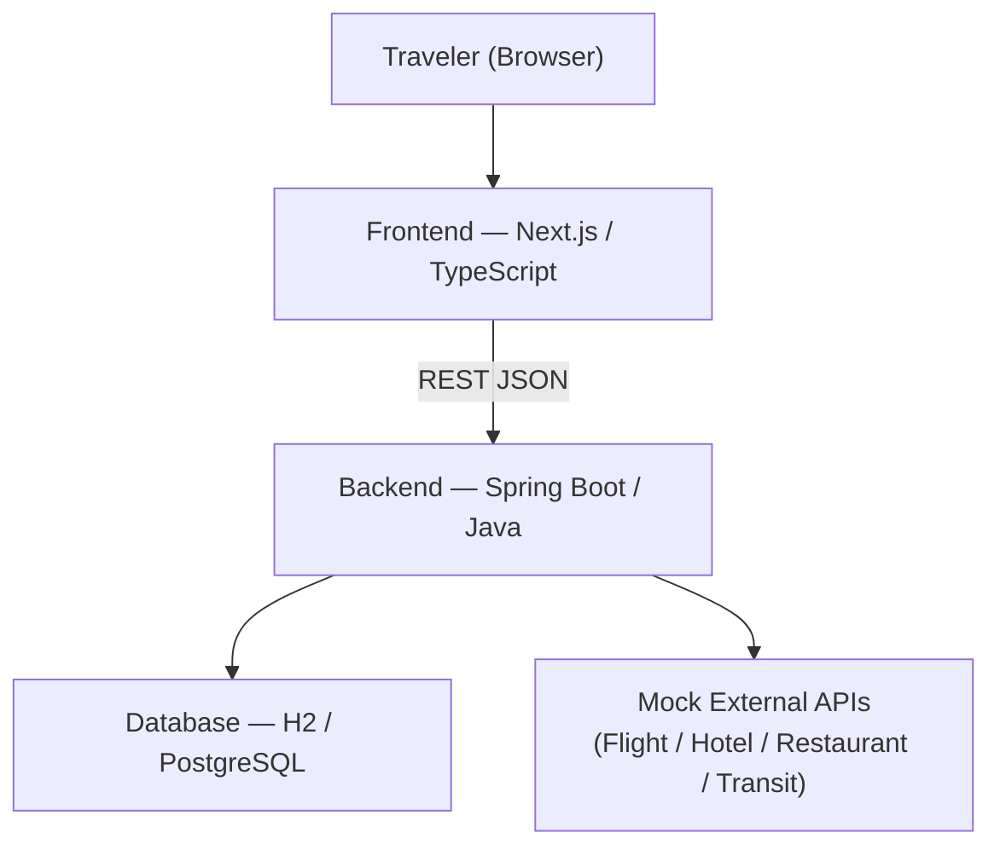
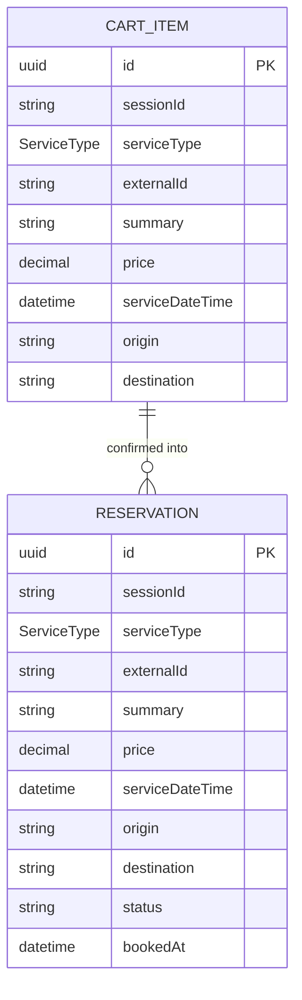

# Implementation Plan: myAdventure

**Version**: 1.0.0
**Date**: 2026-03-13
**References**: `user_story.md`, `requirements.md`

---

## 1. Chain of Thought

### Problem Summary
Build a web-based OTA-style travel app where users plan trips, book services (flights, hotels, restaurants, transit), manage a cart, view itineraries, and adjust schedules on the fly.

### Key Design Decisions
1. **Next.js** for frontend — SSR improves search result SEO; TypeScript is required; familiar OTA-style UX patterns are well-supported.
2. **Spring Boot** for backend — standard Java framework; REST API; clean layering (Controller → Service → Repository).
3. **Mock External APIs** — real booking APIs (Amadeus, Google Hotels) are out of scope for v1.0; use stub/mock services to satisfy acceptance criteria.
4. **H2 (dev) / PostgreSQL (prod)** — JPA-based persistence; H2 for fast local iteration.
5. **Session-scoped cart** — no auth in v1.0; cart lives in server-side session (HTTP session or Redis-backed).

---

## 2. Technology Stack

| Layer | Choice | Rationale |
|-------|--------|-----------|
| Frontend | Next.js 14 (App Router) + TypeScript | SSR, file-based routing, TypeScript |
| UI Components | Tailwind CSS + shadcn/ui | Fast OTA-style UI |
| State Management | Zustand | Lightweight; good for cart/itinerary state |
| Backend | Java 25 + Spring Boot 3.x | Company standard |
| ORM | Spring Data JPA + Hibernate | Clean repository pattern |
| DB (dev) | H2 in-memory | Zero-config local dev |
| DB (prod) | PostgreSQL | Production-grade |
| API Style | REST (JSON) | Simple, well-understood |
| Build | Gradle (backend), npm (frontend) | Standard tooling |
| Testing | JUnit 5 + Mockito (BE), Jest + React Testing Library (FE) | TDD support |

---

## 3. Directory Structure

```
myAdventure/
├── frontend/                      # Next.js TypeScript app
│   ├── app/
│   │   ├── app_page.tsx               # Landing / search page
│   │   ├── search/
│   │   │   └── search_page.tsx           # Search results
│   │   ├── cart/
│   │   │   └── cart_page.tsx           # Cart view
│   │   ├── itinerary/
│   │   │   └── itinerary_page.tsx           # Itinerary / schedule view
│   │   └── layout.tsx
│   ├── components/
│   │   ├── SearchForm.tsx
│   │   ├── CandidateCard.tsx
│   │   ├── CartItem.tsx
│   │   └── ItineraryTimeline.tsx
│   ├── lib/
│   │   ├── api.ts                 # Axios/fetch wrappers to backend
│   │   └── store.ts               # Zustand store (cart, itinerary)
│   └── package.json
│
├── backend/                       # Spring Boot Java app
│   └── src/main/java/com/myadventure/
│       ├── controller/
│       │   ├── SearchController.java
│       │   ├── CartController.java
│       │   ├── BookingController.java
│       │   └── ItineraryController.java
│       ├── service/
│       │   ├── SearchService.java
│       │   ├── CartService.java
│       │   ├── BookingService.java
│       │   └── ItineraryService.java
│       ├── repository/
│       │   ├── ReservationRepository.java
│       │   └── CartRepository.java
│       ├── model/
│       │   ├── Reservation.java
│       │   ├── CartItem.java
│       │   ├── Itinerary.java
│       │   └── enums/ServiceType.java
│       ├── external/              # Mock external API adapters
│       │   ├── FlightAdapter.java
│       │   ├── HotelAdapter.java
│       │   ├── RestaurantAdapter.java
│       │   └── TransitAdapter.java
│       └── MyAdventureApplication.java
│
└── specs/
    ├── user_story.md
    ├── requirements.md
    └── plan.md                    # this file
```

---

## 4. System Architecture



---

## 5. Data Model



`ServiceType` enum: `FLIGHT | HOTEL | RESTAURANT | TRANSIT`

---

## 6. REST API Endpoints

| Method | Path | Description | Req ID |
|--------|------|-------------|--------|
| GET | `/api/search` | Search candidates by dates, origin, destination, type | F-01–F-04 |
| GET | `/api/cart/{sessionId}` | Get cart items | F-06 |
| POST | `/api/cart` | Add item to cart | F-06 |
| DELETE | `/api/cart/{itemId}` | Remove item from cart | F-07 |
| POST | `/api/bookings` | Confirm reservation from cart | F-05, F-08 |
| GET | `/api/itinerary/{sessionId}` | Get full itinerary (chronological) | F-09–F-11 |
| PATCH | `/api/bookings/{id}` | Modify a reservation | F-12 |
| DELETE | `/api/bookings/{id}` | Cancel a reservation | F-13 |
| GET | `/api/search/alternatives` | Get alternatives for a change | F-14 |

---

## 7. Implementation Phases

### Phase 0 — Project Scaffolding
**Goal**: Runnable skeleton with CI-ready structure.

- [x] Initialize Next.js 14 app in `frontend/` with TypeScript + Tailwind
- [x] Initialize Spring Boot 3 project in `backend/` with Gradle
- [x] Configure CORS on Spring Boot to allow `localhost:3000`
- [x] Add H2 datasource and JPA config
- [x] Health check endpoint: `GET /api/health`
- [x] Verify frontend can call backend health endpoint

**Exit criteria**: `npm run dev` + `./gradlew bootRun` both start; health check returns 200.

---

### Phase 1 — Search (F-01 – F-04)
**Goal**: User searches and sees candidates for all 4 service types.

**Backend**
- [x] Define `SearchRequest` DTO (origin, destination, departureDate, returnDate, serviceTypes)
- [x] Implement `FlightAdapter`, `HotelAdapter`, `RestaurantAdapter`, `TransitAdapter` returning mock `CandidateDTO` lists
- [x] Implement `SearchService` — fan-out to adapters, aggregate results
- [x] Implement `GET /api/search` in `SearchController`
- [x] Unit tests: `SearchServiceTest` with mocked adapters

**Frontend**
- [x] Build `SearchForm` component (origin, destination, date pickers, service type checkboxes)
- [x] Build `CandidateCard` component (price, summary, "Add to Cart" / "Book Now" buttons)
- [x] Search results page: call `/api/search`, render cards grouped by service type
- [x] Component tests: `SearchForm.test.tsx`

**Exit criteria**: Entering valid dates/destinations shows ≥ 1 candidate per selected service type.

---

### Phase 2 — Itinerary View (F-09 – F-11)
**Goal**: User sees confirmed reservations as a chronological schedule with procedures.

**Backend**
- [x] Implement `Reservation` JPA entity + `ReservationRepository`
- [x] Implement `ItineraryService` — fetch reservations, sort chronologically, attach procedure notes
- [x] Procedure notes: static rules per ServiceType (e.g., "Check in 2 h before flight", "Confirm hotel arrival time")
- [x] Implement `GET /api/itinerary/{sessionId}`
- [x] Unit tests: `ItineraryServiceTest`

**Frontend**
- [x] `ItineraryTimeline` component — vertical timeline grouped by date
- [x] Each entry shows: time, service type icon, summary, price, procedure checklist
- [x] Itinerary page: fetch and render timeline
- [x] Component tests: `ItineraryTimeline.test.tsx`

**Exit criteria**: Confirmed bookings appear in chronological order with pre-trip and in-trip checklists visible.

#### Phase 2 - Modification
- [x] Change the color theme so that the texts are visible on the background. Currently, the letters are white-like color and unvisible.
- [x] Raise an error to notify when the user inputs the return date prior to its departure date. Show the message to prompt the user to input the dates logically correctly.

---

### Phase 3 — Schedule Adjustment (F-12 – F-15)
**Goal**: User can modify or cancel a reservation; itinerary updates automatically.

**Backend**
- [ ] Implement `PATCH /api/bookings/{id}` — update fields, call mock adapter modify, update DB
- [ ] Implement `DELETE /api/bookings/{id}` — cancel, call mock adapter cancel, set status = CANCELLED
- [ ] Implement `GET /api/search/alternatives` — return new mock candidates given changed criteria
- [ ] `ItineraryService` filters out CANCELLED; re-sorts after modification
- [ ] Unit tests: `BookingModificationServiceTest`

**Frontend**
- [ ] "Edit" and "Cancel" buttons on each itinerary entry
- [ ] Edit modal: date/time picker + "Find Alternatives" option
- [ ] Alternatives panel: shows new candidates from `/api/search/alternatives`
- [ ] On save: call `PATCH /api/bookings/{id}`, refresh itinerary
- [ ] On cancel: call `DELETE /api/bookings/{id}`, remove from timeline

**Exit criteria**: Modified reservation updates itinerary without full re-entry; cancelled entry disappears from timeline.

---

### Phase 4 — Cart (F-05 – F-08)
**Goal**: User can add, view, remove, and confirm reservations.

**Backend**
- [ ] Implement `CartItem` JPA entity + `CartRepository`
- [ ] Implement `CartService` (add, list, remove)
- [ ] Implement `POST /api/cart`, `GET /api/cart/{sessionId}`, `DELETE /api/cart/{itemId}`
- [ ] Implement `BookingService` — moves CartItem to `Reservation`, calls mock external adapter confirm
- [ ] Implement `POST /api/bookings`
- [ ] Unit tests: `CartServiceTest`, `BookingServiceTest`

**Frontend**
- [ ] Zustand cart store (add, remove, clear)
- [ ] `CartItem` component
- [ ] Cart page: list items, total price, "Confirm All" button
- [ ] On confirm: call `POST /api/bookings` per item, update itinerary
- [ ] Cart persists across page navigations within session

**Exit criteria**: Items in cart survive navigation; confirming moves them to itinerary.

---

### Phase 5 — Polish & Acceptance Testing
**Goal**: UI matches OTA conventions; all acceptance criteria pass.

- [ ] Apply OTA-style design: header with logo + nav, search bar prominent, card-based results
- [ ] Responsive layout (desktop-first, mobile usable)
- [ ] Loading skeletons on search and itinerary
- [ ] Error states (no results, booking failure)
- [ ] End-to-end smoke test: Search → Add to Cart → Confirm → View Itinerary → Modify → Cancel
- [ ] Verify all acceptance criteria from `requirements.md § 9`

---

## 8. Acceptance Criteria Traceability

| ID | Feature | Criterion | Phase |
|----|---------|-----------|-------|
| F-01–04 | Search | Results for all 4 types given valid input | 1     |
| F-09–11 | Itinerary | Chronological view with procedure checklists | 2     |
| F-12–15 | Change | Modify updates itinerary; no full re-entry needed | 3     |
| F-05–08 | Cart | Items persist; confirm creates reservation | 4     |
| NF-01 | UI | OTA-style conventions applied | 5     |
| NF-02–03 | Code quality | Clean layering, independent FE/BE deployment | All   |

---

## 9. Out of Scope (v1.0)

- Payment processing (mock/placeholder only)
- User authentication
- Car rental, tours, activities
- Native mobile apps
- Real-time notifications (push/email)

---

## 10. Risk & Mitigations

| Risk | Mitigation |
|------|-----------|
| Real external APIs unavailable | Use mock adapters returning realistic static data |
| Session handling without auth | Use UUID session token stored in browser localStorage, passed as header |
| Cart state lost on refresh | Persist session ID in localStorage; backend holds cart state in DB |
