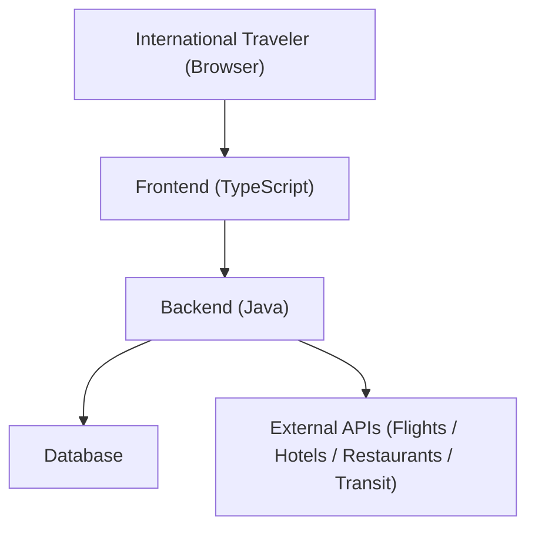
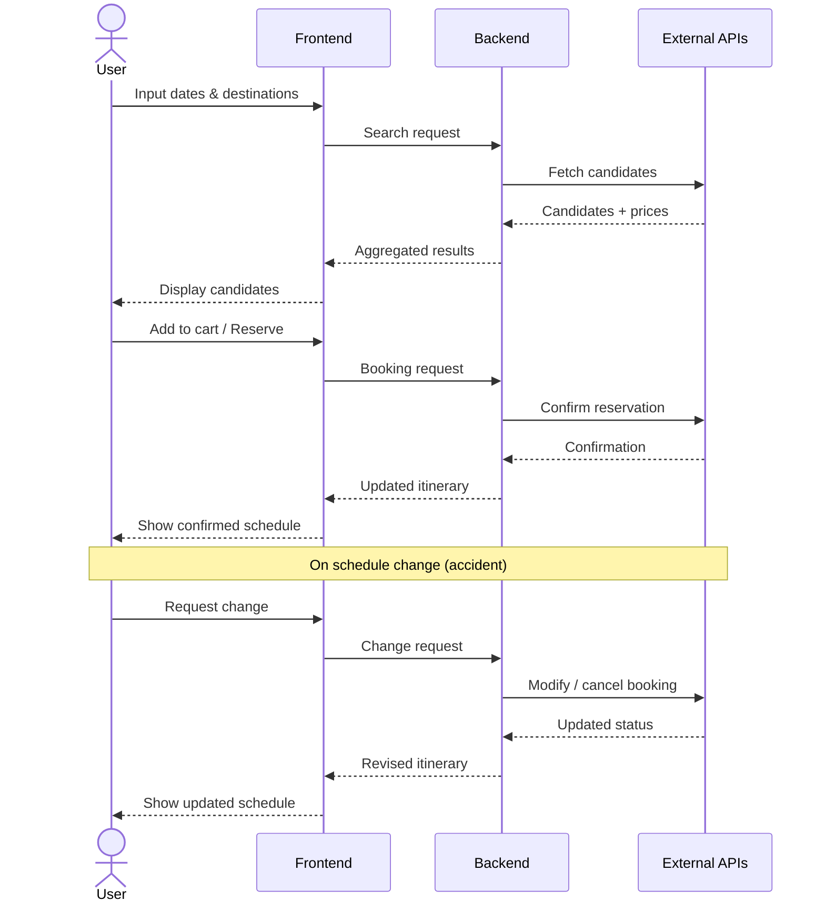

# Requirements Definition DocumentCould

## 1. Project Overview

**Product Name**: myAdventure
**Document Date**: 2026-03-08
**Version**: 1.0.0

A web-based travel itinerary and reservation management application targeting international travelers, enabling end-to-end trip planning with seamless booking and real-time schedule adjustment.

---

## 2. Stakeholders

| Role | Description |
|------|-------------|
| International Traveler | Primary end user planning and executing trips |
| Developer | Full-stack engineer maintaining and extending the system |

---

## 3. Functional Requirements

### 3.1 Trip Planning

| ID | Requirement |
|----|-------------|
| F-01 | User can input travel dates (departure and return) |
| F-02 | User can input destination(s) and origin |
| F-03 | System displays reservation candidates for flights, hotels, restaurants, and public transportation |
| F-04 | Each candidate displays price, availability, and key details |

### 3.2 Reservations

| ID | Requirement                                                                             |
|----|-----------------------------------------------------------------------------------------|
| F-05 | User can make a confirmed reservation                                                   |
| F-06 | User can add reservation candidates to a cart (similar to e-commerce) |
| F-07 | User can remove items from the cart                                                     |
| F-08 | User can proceed from cart to confirmed booking                                         |

### 3.3 Itinerary Management

| ID | Requirement |
|----|-------------|
| F-09 | User can view the full itinerary as a chronological schedule |
| F-10 | User can view pre-trip procedures (check-in deadlines, visa requirements, etc.) |
| F-11 | User can view in-trip procedures (transit steps, hotel check-in times, etc.) |

### 3.4 Schedule Adjustment

| ID | Requirement |
|----|-------------|
| F-12 | User can modify existing reservations (date, time, seat, room, etc.) |
| F-13 | User can cancel a reservation |
| F-14 | System shows alternative options when a change is triggered |
| F-15 | System updates the downstream itinerary automatically after a change |

---

## 4. Non-Functional Requirements

### 4.1 Usability

| ID    | Requirement |
|-------|-------------|
| NF-01 | UI follows Online Travel Agency (OTA) conventions (Expedia, Agoda, Booking.com, Skyscanner, Yeogiotte) |

### 4.2 Maintainability & Scalability

| ID    | Requirement |
|-------|-------------|
| NF-02 | Code must be simple, comprehensible, and well-structured for future development |
| NF-03 | Backend and frontend are independently deployable services |

---

## 5. Technology Stack

| Layer | Technology |
|-------|-----------|
| Frontend | TypeScript (framework TBD: e.g., Next.js, React, Angular) |
| Backend | Java (framework TBD: e.g., Spring Boot) |
| API Style | REST or GraphQL between frontend and backend |

---

## 6. System Architecture (High-Level)

---

## 7. User Flow

---

## 8. Scope Boundaries

### In Scope

- Flight, hotel, restaurant, and public transportation search and booking
- Cart (deferred reservation) functionality
- Itinerary view with pre-trip and in-trip procedures
- Schedule modification and cancellation

### Out of Scope (for v1.0)

- Payment processing (placeholder/mock only)
- User authentication and account management
- Car rental, tours, and activities
- Native mobile applications
- Real-time notifications (e.g., push/email alerts for flight delays)

---

## 9. Acceptance Criteria Summary

| Feature | Acceptance Criterion |
|---------|---------------------|
| Search | Results appear for all 4 service types given valid dates and destinations |
| Cart | Items persist in cart across page navigations within a session |
| Booking | Confirmed reservation appears in itinerary chronological view |
| Change | Modified reservation updates itinerary without requiring full re-entry |
| Procedures | Pre-trip and in-trip checklists are visible per reservation |

---
